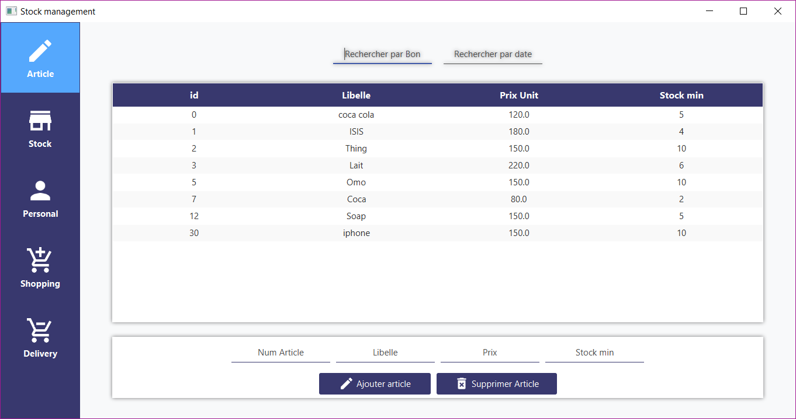
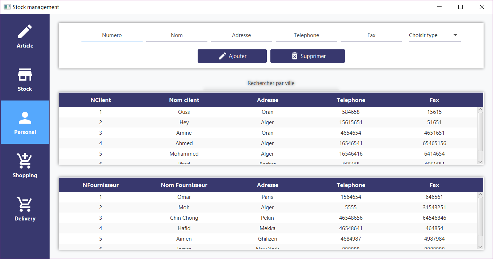
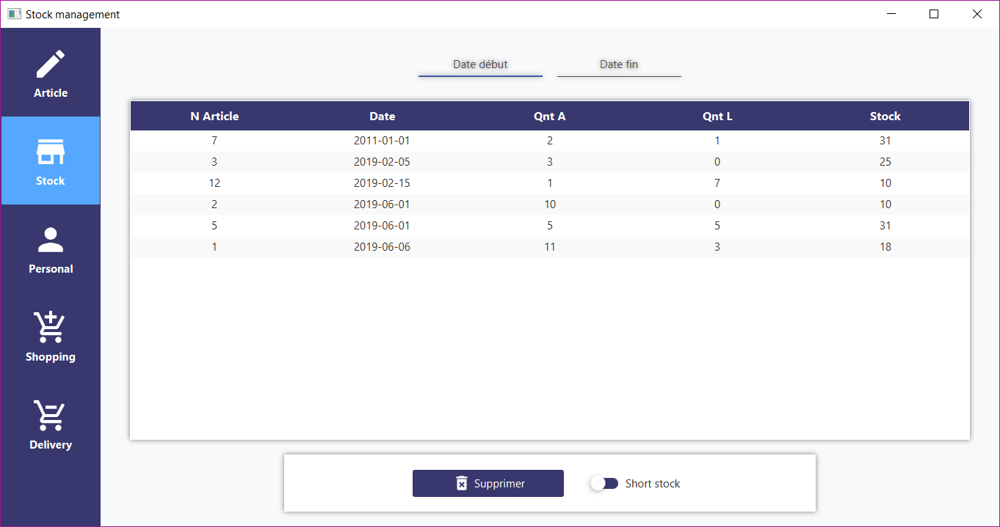
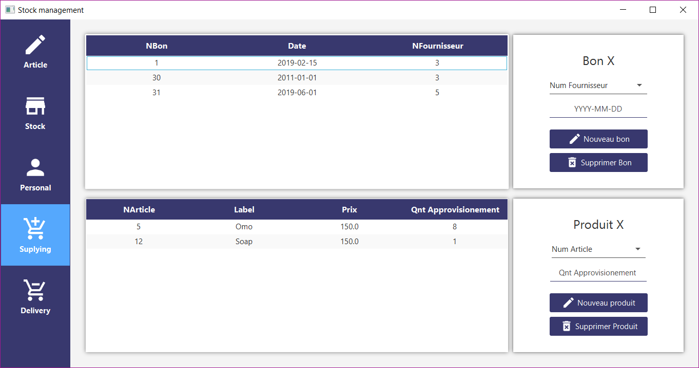

# GestionStockJavaFX

A school assignement designed to teach about the SOAP web services.

## Screenshots:
### Articles management scene:

### Clients/Suppliers scene:

### Stock management scene:

### Supplying stock scene:

## Description:
The app helps a business owner manager his purchases with various clients and suppliers.

## Tools used:
* JavaFX
* Java (logic)
* FXML (Design)
* IntellijIdea (IDE)

## TODO:
- [ ] Add client side integration with the web service.

## Contributing
Feel free to `fork` this project and add whatever you like (Helping with the TODOs would be amazing tho). If you have any suggestions or any comments please feel free to contact me or to open an issue.

## Team:
[Jetlighters](https://github.com/JetLightStudio) having fun.
